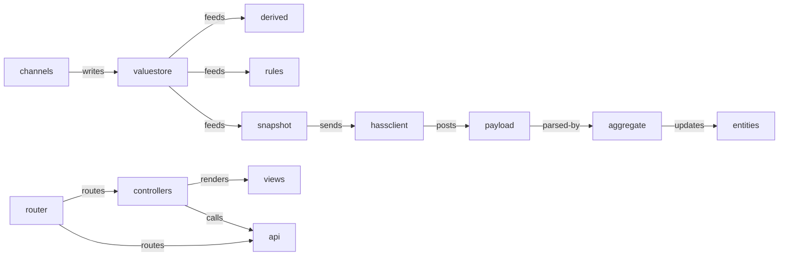

# Графы проекта (сгенерировано)

> Регенерация: `.venv/bin/python scripts/graphs/build_graphs.py` (в корне репозитория).

Машиночитаемые графы для работы над проектом: `docs/graphs/functional.json`,
`docs/graphs/semantic.json`, плоский индекс `docs/graphs/index.json`.

## Функциональный граф — поток данных

Узлов: 1020, рёбер: 1157. Структура кода — `repo → module → package → file → class/function`;
связи `imports`/`requires`/`routes-to`; размеченные data-flow вехи.

## Семантический граф — каналы → сенсоры → HA-сущности

```mermaid
flowchart LR
  diplus[diplus] --> power_state[power_state]
  adb[adb] --> power_state[power_state]
  diplus[diplus] --> speed[speed]
  adb[adb] --> speed[speed]
  obd[obd] --> speed[speed]
  voyah[voyah] --> speed[speed]
  diplus[diplus] --> range[range]
  adb[adb] --> range[range]
  voyah[voyah] --> range[range]
  diplus[diplus] --> gear[gear]
  adb[adb] --> gear[gear]
  voyah[voyah] --> gear[gear]
  diplus[diplus] --> engine_rpm[engine_rpm]
  obd[obd] --> engine_rpm[engine_rpm]
  diplus[diplus] --> brake_pedal[brake_pedal]
  voyah[voyah] --> brake_pedal[brake_pedal]
  diplus[diplus] --> accel_pedal[accel_pedal]
  obd[obd] --> accel_pedal[accel_pedal]
  voyah[voyah] --> accel_pedal[accel_pedal]
  diplus[diplus] --> front_motor_rpm[front_motor_rpm]
  diplus[diplus] --> rear_motor_rpm[rear_motor_rpm]
  diplus[diplus] --> engine_power[engine_power]
  adb[adb] --> engine_power[engine_power]
  diplus[diplus] --> front_motor_torque[front_motor_torque]
  diplus[diplus] --> charge_gun_state[charge_gun_state]
  adb[adb] --> charge_gun_state[charge_gun_state]
  voyah[voyah] --> charge_gun_state[charge_gun_state]
  diplus[diplus] --> energy_per_100km[energy_per_100km]
  diplus[diplus] --> battery_temp_max[battery_temp_max]
  adb[adb] --> battery_temp_max[battery_temp_max]
  diplus[diplus] --> battery_temp_avg[battery_temp_avg]
  diplus[diplus] --> battery_temp_min[battery_temp_min]
  adb[adb] --> battery_temp_min[battery_temp_min]
  diplus[diplus] --> cell_voltage_max[cell_voltage_max]
  diplus[diplus] --> cell_voltage_min[cell_voltage_min]
  diplus[diplus] --> last_wiper_time[last_wiper_time]
  diplus[diplus] --> weather[weather]
  diplus[diplus] --> driver_seatbelt[driver_seatbelt]
  adb[adb] --> driver_seatbelt[driver_seatbelt]
  voyah[voyah] --> driver_seatbelt[driver_seatbelt]
  ac_on[/ac_on/] -.controls.-> ac_state
  ac_off[/ac_off/] -.controls.-> ac_state
  ac_temp[/ac_temp/] -.controls.-> ac_set_temp
  ac_recirc[/ac_recirc/] -.controls.-> ac_recirculation
  window_driver[/window_driver/] -.controls.-> window_fl
  window_passenger[/window_passenger/] -.controls.-> window_fr
  window_rear_left[/window_rear_left/] -.controls.-> window_rl
  window_rear_right[/window_rear_right/] -.controls.-> window_rr
  windows_close_all[/windows_close_all/] -.controls.-> windows_all_state
  windows_vent[/windows_vent/] -.controls.-> windows_all_state
  sunroof[/sunroof/] -.controls.-> sunroof
  sunshade[/sunshade/] -.controls.-> sunshade
  doors_unlock[/doors_unlock/] -.controls.-> remote_lock_state
  doors_lock[/doors_lock/] -.controls.-> remote_lock_state
  interior_light_on[/interior_light_on/] -.controls.-> footwell_light
  interior_light_off[/interior_light_off/] -.controls.-> footwell_light
  drl_on[/drl_on/] -.controls.-> drl
  drl_off[/drl_off/] -.controls.-> drl
  hazard_on[/hazard_on/] -.controls.-> hazard
  hazard_off[/hazard_off/] -.controls.-> hazard
```

Узлов: 308, рёбер: 988. Понятия: `sensor`, `channel`, `command`,
`ha_entity_set`, `profile`, `project`, `role`; связи `provides`/`controls`/`maps-to`/`via`/`core`.
